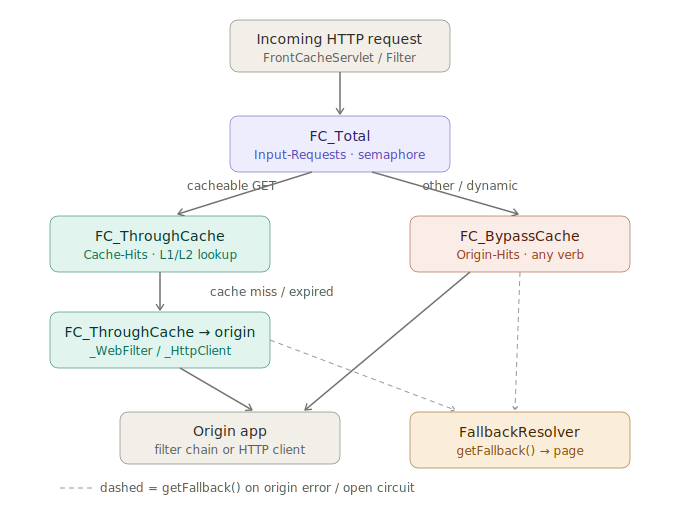

# HTTP request flow through Hystrix commands

How HTTP requests flow through the `HystrixCommand` wrappers in the
`org.frontcache.hystrix` package. Every origin/cache touch is wrapped in a
command so it gets circuit-breaking, timeouts, and metrics.

## Commands, in order

### `FC_Total`
The outer wrapper. [`FrontCacheEngine.processRequest`](../frontcache-core/src/main/java/org/frontcache/FrontCacheEngine.java)
runs every request through it.

- Group key = the request domain; command key = `Input-Requests`.
- Runs as a **semaphore** (not a thread pool), so it executes on the caller
  thread, then delegates to `processRequestInternal`.
- `getFallback()` writes a fallback page.

### `FC_ThroughCache`
Only cacheable GETs reach it, via
[`CacheProcessorBase`](../frontcache-core/src/main/java/org/frontcache/cache/CacheProcessorBase.java).

- Group key = the request domain; command key = `Cache-Hits`; `run()` does the
  L1 (Ehcache) / L2 (Lucene) lookup.
- The domain comes from the `RequestContext`. For admin lookups via
  `FrontCacheIOServlet` the context is `null`, so the group key falls back to
  `FCConfig.DEFAULT_DOMAIN`. (`getFromCache(url, context)` carries the context
  through from `processRequest` and the include processor.)
- Its `getFallback()` only logs and returns `null` — the only command that does
  **not** serve a fallback page.

### `FC_ThroughCache_WebFilter` / `FC_ThroughCache_HttpClient`
On a cache miss/expiry,
[`FCUtils.dynamicCall`](../frontcache-core/src/main/java/org/frontcache/core/FCUtils.java)
picks one of these to fetch from origin. They carry distinct command keys so
their origin traffic shows up separately in the Hystrix metrics stream.

- `FC_ThroughCache_WebFilter` — filter mode (`chain.doFilter` to the origin app
  in the same container). Command key `Cache-Origin-filter`.
- `FC_ThroughCache_HttpClient` — standalone mode (HTTP GET to the origin host).
  Command key `Cache-Origin-http`. Includes (`<fc:include>`) also reuse
  `_HttpClient` (via `includeDynamicCallHttpClient`).
- Both run on the shared `OriginHitsPool` thread pool.
- Both serve a `FallbackResolver` page on failure.

`Cache-Origin-http` and `Cache-Origin-filter` each get their own command config
in `hystrix.properties` (THREAD isolation, 5000 ms timeout), and `OriginHitsPool`
its own `coreSize`.

### `FC_BypassCache`
Everything else (non-GET verbs, `dynamic-urls.conf` matches, dynamic requests)
skips the cache entirely, via
[`FrontCacheEngine`](../frontcache-core/src/main/java/org/frontcache/FrontCacheEngine.java).

- Command key = `Origin-Hits`; forwards any verb to origin (filter chain or HTTP
  client). Runs on the shared `OriginHitsPool` thread pool.
- `getFallback()` writes a fallback page.

## Fallbacks
When a command's `run()` throws or its circuit is open, Hystrix calls
`getFallback()`, which asks `FallbackResolverFactory` (default
`FileBasedFallbackResolver`, configured in `fallbacks.conf`) for a fallback page.
`FC_Total`, `FC_BypassCache`, and both `FC_ThroughCache_*` origin commands all
serve fallbacks this way. `FC_ThroughCache` (the cache lookup) is the exception —
it returns `null`.

## Command key / group summary

| Command | Group key | Command key | Thread isolation |
|---|---|---|---|
| `FC_Total` | request domain | `Input-Requests` | semaphore |
| `FC_ThroughCache` | request domain (`DEFAULT_DOMAIN` if no context) | `Cache-Hits` | thread pool (default) |
| `FC_ThroughCache_WebFilter` | request domain | `Cache-Origin-filter` | `OriginHitsPool` |
| `FC_ThroughCache_HttpClient` | request domain | `Cache-Origin-http` | `OriginHitsPool` |
| `FC_BypassCache` | request domain | `Origin-Hits` | `OriginHitsPool` |
