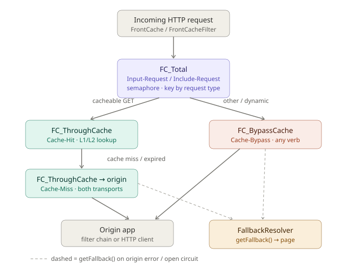

# HTTP request flow through resilience commands

How HTTP requests flow through the `FcCommand` wrappers in the
`org.frontcache.resilience` package. Every origin/cache touch is wrapped in a
command so it gets circuit-breaking, timeouts, and metrics.

As of 2.7 these run on **Resilience4j 2.x** — Netflix Hystrix is gone. The command
class names, the property key prefixes and the dashboard wire format were kept; see
[Names that did not change](#names-that-did-not-change).

**2.9.0 renamed the command keys** and split one of them in two. An un-edited
`resilience.properties` keeps working — every new key inherits its old name's settings — but the
dashboard and `/fc-metrics` show the new names. See [the renames](#renamed-command-keys).

## Commands, in order

### `FC_Total`
The outer wrapper. `FrontCacheEngine.processRequest` runs every request through it.

- Group key = the request domain; command key is **one of two**, chosen per request:
  `Input-Request` for client traffic, `Include-Request` for an `<fc:include>` arriving back
  through this node's own front door. `FC_Total.commandKeyFor` reads the request type `init()`
  already computed — the same `toplevel` / `include` / `include-async` the request log prints,
  derived from whether the caller sent `x-frontcache-request-id`. No new header.
- **Each key owns its own breaker, bulkhead and time limiter**, so includes no longer consume
  the permits meant for client traffic, and the headline traffic number is client traffic alone.
  On a standalone node fetching includes from the origin, `Include-Request` reads ~0 — that is
  the intended reading, not a broken counter.
- Runs under a **semaphore** (`execution.isolation.strategy=SEMAPHORE`, a
  Resilience4j `Bulkhead` permit), so it executes on the caller thread, then
  delegates to `processRequestInternal`.
- `getFallback()` writes a fallback page.

### `FC_ThroughCache`
Only cacheable GETs reach it, via `CacheProcessorBase`.

- Group key = the request domain; command key = `Cache-Hit`; `run()` does the
  L1 (Ehcache) / L2 (Lucene) lookup.
- The domain comes from the `RequestContext`. For admin lookups via
  `FrontCacheIOServlet` the context is `null`, so the group key falls back to
  `front-cache.default-domain` (and to `FCConfig.DEFAULT_DOMAIN` if that is unset).
  (`getFromCache(url, context)` carries the context through from `processRequest`
  and the include processor.)
- Its `getFallback()` only logs and returns `null` — the only command that does
  **not** serve a fallback page.

### `FC_ThroughCache_WebFilter` / `FC_ThroughCache_HttpClient`
On a cache miss/expiry, `FCUtils.dynamicCall` picks one of these to fetch from origin. **Since
2.9.0 they share one command key, `Cache-Miss`** — two classes, one breaker, one bulkhead, one
row on the dashboard.

- `FC_ThroughCache_WebFilter` — filter mode (`chain.doFilter` to the origin app
  in the same container).
- `FC_ThroughCache_HttpClient` — standalone mode (HTTP GET to the origin host).
  Includes (`<fc:include>`) also reuse `_HttpClient` (via `includeDynamicCallHttpClient`).
- Both run on the shared `OriginPool` thread pool.
- Both serve a `FallbackResolver` page on failure.

They used to be `Cache-Origin-filter` and `Cache-Origin-http`, which named the **transport** —
a property of how the node is deployed, not of what the command does. Both are "the origin call
behind a cache miss", and an operator tuning one always wanted the same number in the other.

> **On a filter-mode node this is a behaviour change, and only there.** A standalone node only
> ever used the http key. A filter-mode node uses the filter chain for the page's own origin call
> and HTTP for its include fetches, so it had two independent breakers over the same origin and
> now has one. A breaker that sees all of one origin's failures opens on evidence the split
> version was throwing away — but the concurrency permits are shared too, so if you had sized
> those two stanzas as separate ceilings, set `Cache-Miss` deliberately.

`Cache-Miss` gets its own command config in `resilience.properties` (THREAD isolation,
10000 ms timeout), and `OriginPool` its own `coreSize`.

### `FC_BypassCache`
Everything else (non-GET verbs, `dynamic-urls.conf` matches, dynamic requests)
skips the cache entirely, via `FrontCacheEngine`.

- Command key = `Cache-Bypass`; forwards any verb to origin (filter chain or HTTP
  client). Runs on the shared `OriginPool` thread pool.
- `getFallback()` writes a fallback page.

## Isolation: two paths

`execution.isolation.strategy` selects which one a command takes, and the two
behave differently on timeout.

- **Semaphore path** (`Input-Request`, `Include-Request`, `Cache-Hit`) — a circuit breaker wrapping
  a `Bulkhead` permit, run inline on the request thread. `FC_Total` writes the
  servlet response from its fallback, so it has to stay on that thread. There is no
  `TimeLimiter` here and there cannot be: Resilience4j's takes a `Future`, and
  wrapping this path in one would move `FC_Total` off the request thread. The
  configured `execution.isolation.thread.timeoutInMilliseconds` for these keys
  is therefore observed, not enforced: a watchdog sweeps the in-flight registry and
  logs a `WARN` naming the command, its budget and the elapsed time, plus a
  `rollingCountBudgetOverrunObserved` counter on the dashboard frame. It never aborts,
  never resolves a fallback, and never moves the failure rate — an overrun means
  "this succeeded, but late".
- **Thread path** (`Cache-Miss`, `Cache-Bypass`) — a
  circuit breaker wrapping a real `TimeLimiter` over a submit to `OriginPool`.
  `interruptOnTimeout=true` maps to `cancelRunningFuture(true)`, which is still only
  an interrupt — which is why `FC_ThroughCache_HttpClient.getFallback()` also aborts
  the pending `HttpGet`: a blocking socket read ignores the interrupt flag, and
  without the abort the pooled connection is held for another full socket timeout.

`OriginPool` is a plain `ThreadPoolExecutor` Frontcache owns, not a
Resilience4j `ThreadPoolBulkhead`: with `maxQueueSize=-1` it runs a
`SynchronousQueue`, so a submit with no free thread is rejected immediately rather
than queued. A queue in front of a slow origin would convert fast rejection (and a
fallback) into latency, which is the opposite of what the isolation is for.

Bulkhead and thread-pool rejections are excluded from the circuit breaker's error
percentage, so a busy node does not open its own circuits just because it is busy.

## Fallbacks
When a command's `run()` throws or its circuit is open, `FcCommand.execute()` calls
`getFallback()` — on the calling thread, from its own `catch` block — which asks
`FallbackResolverFactory` (default `FileBasedFallbackResolver`, configured in
`fallbacks.conf`) for a fallback page. `FC_Total`, `FC_BypassCache`, and both
`FC_ThroughCache_*` origin commands all serve fallbacks this way.
`FC_ThroughCache` (the cache lookup) is the exception — it returns `null`.

## Command key / group summary

| Command | Group key | Command key | Isolation | Timeout |
|---|---|---|---|---|
| `FC_Total` (client request) | request domain | `Input-Request` | semaphore | 20000 ms (observed) |
| `FC_Total` (include at the front door) | request domain | `Include-Request` | semaphore | inherits `Input-Request` |
| `FC_ThroughCache` | request domain (`front-cache.default-domain` if no context) | `Cache-Hit` | semaphore | 1500 ms (observed) |
| `FC_ThroughCache_WebFilter` | request domain | `Cache-Miss` | `OriginPool` | 10000 ms |
| `FC_ThroughCache_HttpClient` | request domain | `Cache-Miss` | `OriginPool` | 10000 ms |
| `FC_BypassCache` | request domain | `Cache-Bypass` | `OriginPool` | 20000 ms |

One node serves one site, so there is exactly one group key at runtime. Commands,
metrics and breakers are keyed by command key alone; thread pools are node-level
resources.

## Renamed command keys

| Through 2.8.0 | 2.9.0 | |
|---|---|---|
| `Input-Requests` | `Input-Request` | and it no longer counts this node's own includes |
| `Include-Requests` | `Include-Request` | split out of the above; a key of its own since 2.9.0 |
| `Cache-Hits` | `Cache-Hit` | spelling only — still every cache lookup, hit or miss |
| `Origin-Hits` | `Cache-Bypass` | says what it is: the origin call for a request that never consults the cache |
| `Cache-Origin-http` `Cache-Origin-filter` | `Cache-Miss` | **two keys combined into one** |
| `OriginHitsPool` | `OriginPool` | the thread pool, shared by `Cache-Miss` and `Cache-Bypass` |

**An un-edited `resilience.properties` keeps working.** Each new key inherits its old name's
settings property by property, the legacy `hystrix.*` prefix included, and so does the pool key.
The fallback is walked as a **chain**, because the renames stack: on a pre-2.9.0 file
`Include-Request` falls back to `Input-Request`, which falls back to `Input-Requests` — and only
the last of those is in the file.

Without that, a renamed key would land on the built-in defaults — `timeout=1000`,
`maxConcurrentRequests=10`. For an origin call tuned to ten or twenty seconds that is not a
metrics change, it is an outage under load. The pool key is sharper still: one that resolves to
nothing falls to `threadpool.default.coreSize`, or on a file that never set one, to the built-in
**10** — every origin call on the node capped at ten threads, having changed nothing.

`Cache-Miss` inherits from `Cache-Origin-http`, the key every deployment mode used. **A node that
deliberately tuned `Cache-Origin-filter` differently is the one case that cannot carry over**, and
has to set `resilience.command.Cache-Miss.*` explicitly.

Until you do edit the file, the dashboard and `/fc-metrics` show the **new** names while your file
says the old ones. That is confusing to read, which is the reason to get to it.

## Names that did not change

Each of these is a wire or config contract read from outside the jar, so it was
kept when the package moved from `org.frontcache.hystrix` to
`org.frontcache.resilience`:

- **`GET /hystrix.stream`** — still served, indefinitely, alongside the current
  `GET /fc-dashboard.stream`. Reverse-proxy no-buffering rules and external
  Turbine point at it.
- **`hystrix.command.*` / `hystrix.threadpool.*` / `hystrix.config.stream.*`
  property keys** — accepted indefinitely alongside the `resilience.*` spelling, so
  existing tuning carries over untouched. **The *file* name is the exception, and its
  grace period is over:** `conf/hystrix.properties` was read as a fallback for one
  release with a warning, and **2.9.0 stopped reading it**. A node that still has only
  that file runs on built-in defaults — a 1-second origin timeout and 10 permits — and
  logs an error naming the fix. Rename it to `conf/resilience.properties`; the key
  prefix inside it needs no change.
- **`"type":"HystrixCommand"` / `"type":"HystrixThreadPool"`** in the stream JSON —
  the type literals any Hystrix-compatible dashboard dispatches on.
- **`org.frontcache.hystrix.fr.*`** in `front-cache.fallback-resolver.impl` —
  remapped on load, with a warning.

Two upgrade traps worth knowing about: if you carry a `conf/fc-logback.xml` over
from 2.6 it still names the old fallback logger, which leaves `logs/fallback.log`
silently empty (the node warns once, with the exact edit); and if both
`hystrix.properties` and `resilience.properties` end up present, the new name wins —
the container and the installer both know about the rename and will not seed a
shipped default over your tuned file.
