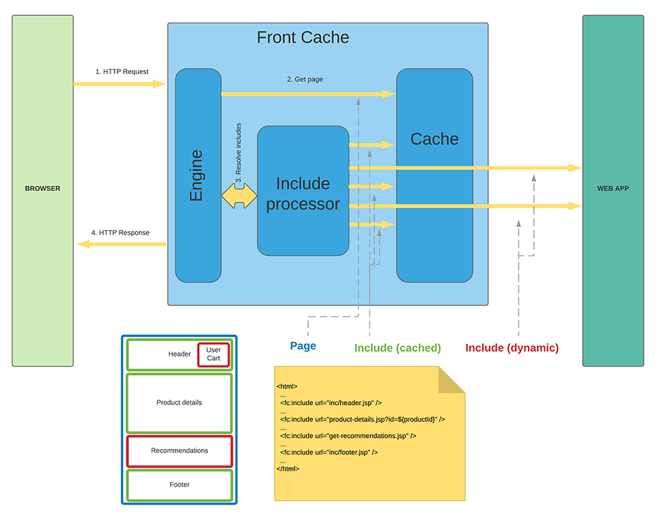

Every page/fragment can set HTTP Headers:
```
X-frontcache.component.maxage = 0  - do not cache (defalut)
X-frontcache.component.maxage = -1 - cache forever
X-frontcache.component.maxage = forever - cache forever
X-frontcache.component.maxage = 60 - cache for 60 seconds
X-frontcache.component.maxage = 60s - cache for 60 seconds
X-frontcache.component.maxage = 15m - cache for 15 minutes
X-frontcache.component.maxage = 24h - cache for 24 hours
```

```
<fc:include /> tag which specifies URL for data to be included:
<fc:include url="/mysite/include-header" /> - this include will make HTTP call to the current webb app with URL  '/mysite/include-header'
<fc:include url="/store/include-product-details-${productId}" /> - this include will make HTTP call to the current web app with URL '/store/include-product-details-${productId}' where ${productId} is a parameter in request scope.
```

Every included data can have caching tag / directives what enables effective page fragment / component caching.
All includes for the same page are run concurrently what allows to speed up a lot comparing to serail call inside standard MVC controller.




